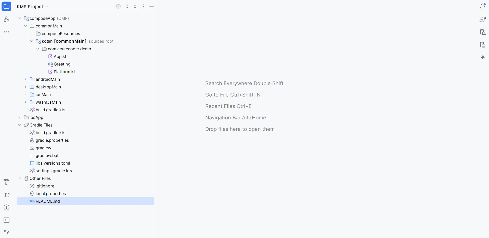
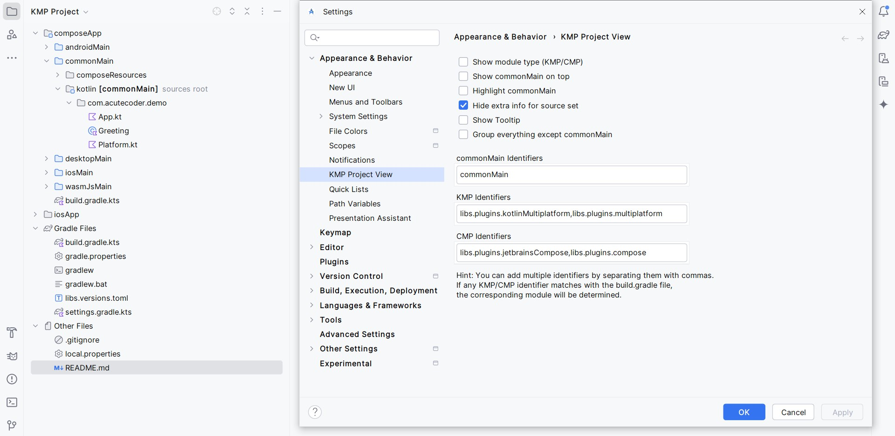
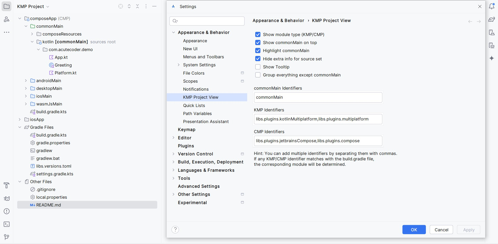
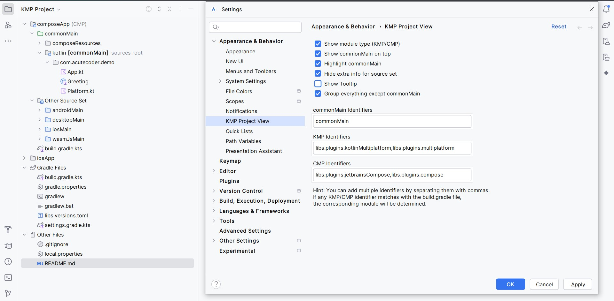

# KmpProjectView

Project View Pane plugin for IntelliJ/Android Studio specifically designed for Kotlin Multiplatform/Compose Multiplatform projects.

## Download
[Get from IntelliJ Marketplace](https://plugins.jetbrains.com/plugin/25442-kmp-project-view)

## Sceenshots

